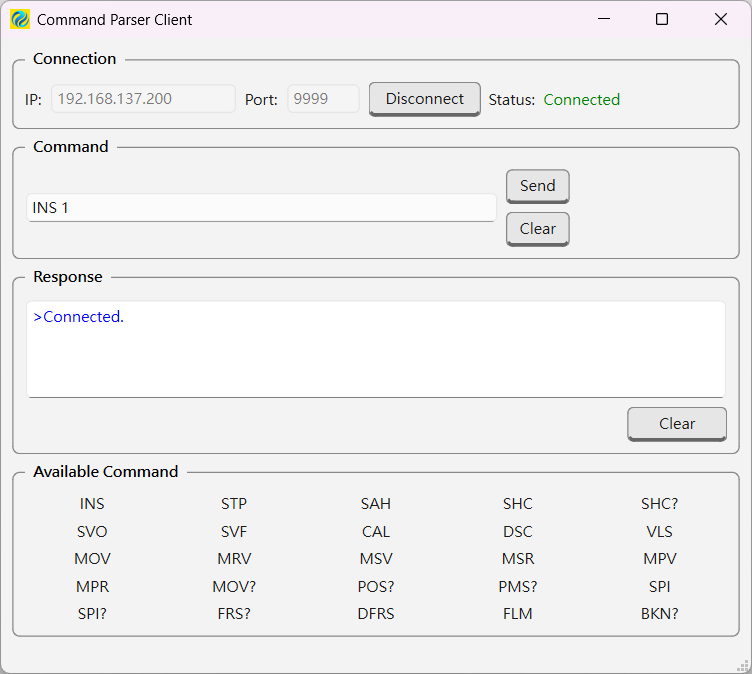
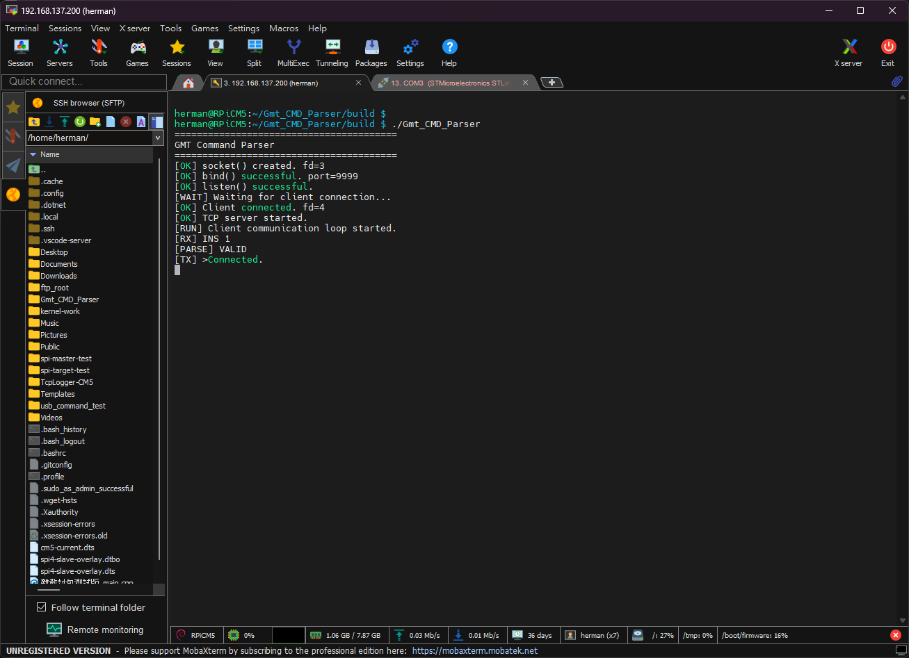

# GMT Command Parser Client Qt

## 專案簡介

`GMT Command Parser Client Qt` 是一套使用 **Qt Widgets** 開發的 Windows TCP Client GUI 工具，用於連接 GMT Command Parser Server，提供工程人員以圖形化介面輸入 Command、傳送命令並查看 Server Response。

本專案主要用途為：

* 測試 GMT Command Parser TCP Server
* 驗證 Command 格式與參數
* 查看 Server Response
* 區分正常 Response 與 Parser Validation Error
* 提供比 CLI Client 更直覺的操作介面

本專案為獨立的 Qt Client，不取代原有的 Golden / Reference CLI Client。

---

## 專案架構

```text
End User
   │
   ▼
GMT Command Parser Client Qt
   │
   │ TCP
   │
   ▼
CM5 Command Parser Server
   │
   ▼
Command Parser
   │
   ├── VALID
   │     │
   │     ▼
   │   Response
   │
   └── INVALID
         │
         ▼
      [ERROR] Response
```

Qt Client 目前只負責：

1. 建立 TCP 連線
2. 傳送 Command
3. 接收 TCP Response
4. 解析 Response line
5. 顯示 Response
6. 區分正常 Response 與 Parser Error

Command 的合法性判斷由 Server 端 Command Parser 負責。

---

## 主要功能

### TCP Connection

支援：

* IP Address 設定
* Port 設定
* Connect
* Disconnect
* Connection Status 顯示

Connection Status：

```text
Disconnected
Connecting...
Connected
Connection Lost
```

---

### Command

支援：

* Command 輸入
* Send Button
* Enter 直接送出 Command
* Command Clear

使用者輸入的 Command 會直接送往 Server。

Qt Client **不自行修改 Command 大小寫或參數內容**，Command validation 由 Server Parser 負責。

---

### Response

Response 區域使用 `QTextEdit` 顯示 Server 回覆。

支援：

* 多行 Response
* Response Clear
* Normal Response
* Parser Error Response
* TCP packet fragmentation
* TCP packet aggregation

例如 Server 可以連續送出：

```text
>STP\r\n
>Done\r\n
```

Client 最終顯示：

```text
>STP
>Done
```

---

## Response Error Handling

Server 對 Parser validation error 使用：

```text
[ERROR]
```

作為 protocol marker。

例如：

```text
[ERROR] Invalid parameters
```

Qt Client 收到後會移除 `[ERROR]` marker，只顯示：

```text
Invalid parameters
```

並以紅色顯示。

正常 Response 則以藍色顯示。

### 重要設計

Qt Client **不自行猜測 Response 文字的語意**。

例如未來 EtherCAT Controller 回傳：

```text
>ERR
```

只要 Server 沒有使用 `[ERROR]` marker，Qt Client 就將它視為正常 Response。

因此：

```text
[ERROR] Invalid parameters
```

代表 Parser Validation Error。

而：

```text
>ERR
```

可能是 Controller 的正常 Response，兩者不混淆。

---

## TCP Response Framing

TCP 是 byte stream，不保證：

```text
send()
```

一定對應：

```text
readyRead()
```

因此 Client 使用 `response_buffer` 暫存接收到的資料，並以：

```text
\r\n
```

作為 Response line 的結束。

例如以下情況都可以正確處理。

### Case 1：Partial Packet

第一次收到：

```text
>ST
```

第二次收到：

```text
P\r\n
```

Client 會組合成：

```text
>STP
```

---

### Case 2：Multiple Responses

一次收到：

```text
>STP\r\n>Done\r\n
```

Client 會解析成兩行：

```text
>STP
>Done
```

---

### Response Buffer Lifecycle

新的 Command：

```text
response_buffer.clear()
```

Response Clear：

```text
response_buffer.clear()
```

Socket Disconnect：

```text
response_buffer.clear()
```

避免不同 Command 或不同 TCP Connection 的資料互相混淆。

---

## Available Commands

目前 GUI 提供以下 Command Reference：

```text
INS
STP
SAH
SHC
SHC?
SVO
SVF
CAL
DSC
VLS
MOV
MRV
MSV
MSR
MPV
MPR
MOV?
POS?
PMS?
SPI
SPI?
FRS?
DFRS
FLM
BKN?
```

實際 Command 格式、參數與 Response 規則以 GMT Command Parser Specification 為準。

---

## GUI

目前 GUI 包含：

```text
┌─ Connection ───────────────────────────────┐
│ IP / Port / Connect / Status               │
└────────────────────────────────────────────┘

┌─ Command ──────────────────────────────────┐
│ Command Input / Send / Clear               │
└────────────────────────────────────────────┘

┌─ Response ─────────────────────────────────┐
│                                            │
│ Server Response                            │
│                                            │
└────────────────────────────────────────────┘

┌─ Available Command ────────────────────────┐
│ INS  STP  SAH  SHC  SHC? ...               │
└────────────────────────────────────────────┘
```

目前 GUI 已加入：

* GMT Logo Window Icon
* 立體按鍵外觀
* GroupBox 外框
* Connection Status 顏色
* Normal Response 藍色
* Error Response 紅色
* Response Clear
* Command Clear

---

## 開發環境

### Operating System

```text
Windows 11
```

### Qt

```text
Qt 6.11.2
```

### Qt Creator

```text
Qt Creator 20.0.1
```

### Compiler

```text
MSVC 2022 64-bit
```

### Build System

```text
CMake
Ninja
```

### Qt Module

```text
Qt Core
Qt Widgets
Qt Network
```

---

## Build

使用 Qt Creator 開啟本專案。

選擇：

```text
Desktop Qt MSVC2022 64bit
```

使用 CMake / Ninja 建置。

Build 成功後即可執行 Client。

---

## Server Connection

預設 Command Parser Server：

```text
IP:
192.168.137.200

Port:
9999
```

啟動 Server 後，在 Qt Client 按下：

```text
Connect
```

確認 Connection Status 顯示：

```text
Connected
```

即可開始測試 Command。

---

## 測試

本專案已完成 TCP Client 基本功能與 Command Parser Client 測試。

已驗證項目包含：

* TCP Connect
* TCP Disconnect
* Connection Status
* Command Send
* Enter Send
* Command Clear
* Response Clear
* Normal Response
* Parser Error Response
* Multi-line Response
* TCP Partial Response
* TCP Multiple Response
* Response Buffer Handling
* Disconnect Buffer Handling
* Command Parser Command 測試

目前 Command 測試皆已通過。

---

## Golden / Reference CLI Client

本專案與既有的 CLI Client 分開維護。

CLI Client 為：

```text
GMT_Client_Command
```

Qt Client 為：

```text
GMT_Client_Command_Qt
```

兩者為獨立專案。

### 重要

**Golden / Reference CLI Client 不修改。**

Qt Client 以既有 CLI Client 的驗證結果與 Command Parser Server 規格作為參考，另外建立 GUI 操作介面。

---

## Server Response Simulation

目前 Server 端仍處於 EtherCAT Controller 尚未正式整合的階段。

因此目前部分 Response 使用 temporary simulation。

例如：

```text
INS 1
```

目前可能回覆：

```text
>Connected.
```

而：

```text
STP
```

目前用於測試多行 Response：

```text
>STP
>Done
```

這些 Simulation Response 並不是最終 EtherCAT Controller Response。

未來正式整合 EtherCAT Controller 後，Temporary Response Simulation 將移除，由實際 Controller Response 取代。

---

## 設計原則

本專案遵循以下原則：

1. Qt Client 不負責 Command Validation
2. Command Parser Server 負責 Command Validation
3. Qt Client 不猜測 Response 語意
4. `[ERROR]` 是 Parser Error 的明確 protocol marker
5. TCP Response 使用 line-based framing
6. Response 使用 buffer 處理 TCP fragmentation / aggregation
7. 不修改 Golden / Reference CLI Client
8. GUI 與 TCP communication logic 保持簡單
9. 避免不必要的架構重構
10. 先驗證功能，再進行 GUI 美化與 Release

---

## 未來工作

目前功能與 GUI 基礎版本已完成。

後續工作包含：

* 完成最終 GUI 微調
* 完整 Command Test Record
* Server 與 EtherCAT Controller 正式 Response 整合
* 移除 Temporary Response Simulation
* Release Build
* Windows Portable 版本
* Portable 版本實機測試

---

## Project Status

目前狀態：

```text
[PASS] TCP Connection
[PASS] Command Send
[PASS] Response Display
[PASS] Error Response Handling
[PASS] Multi-line Response
[PASS] TCP Response Framing
[PASS] Response Buffer Handling
[PASS] Command Testing
[PASS] GUI Basic Design
[PASS] Application Icon
[PASS] Button Styling
[PASS] GroupBox Styling
```
## 運作圖




